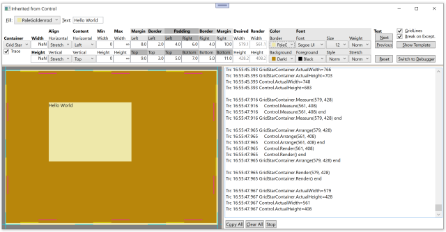
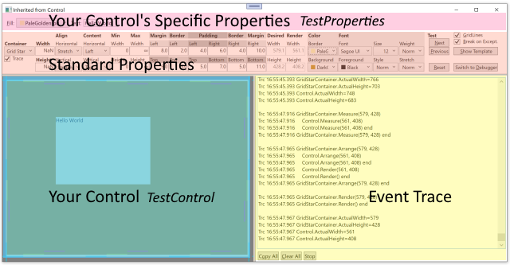
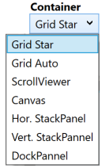
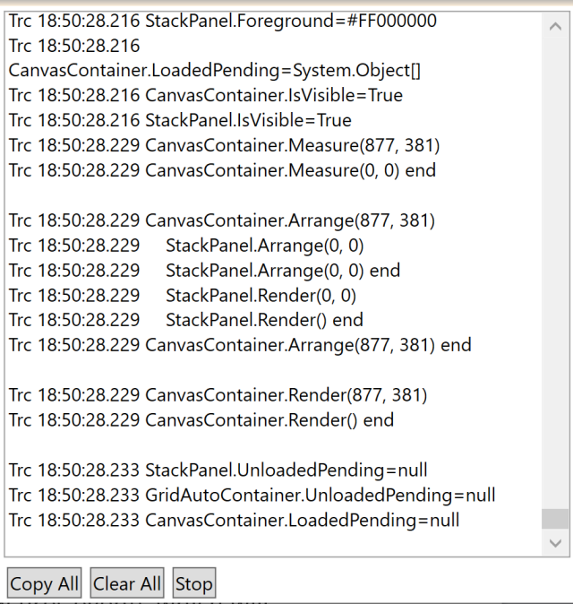
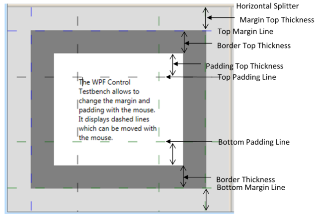
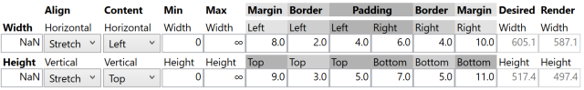
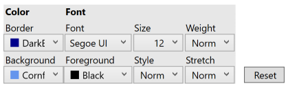
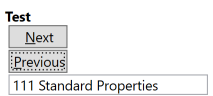
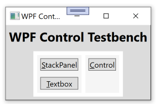
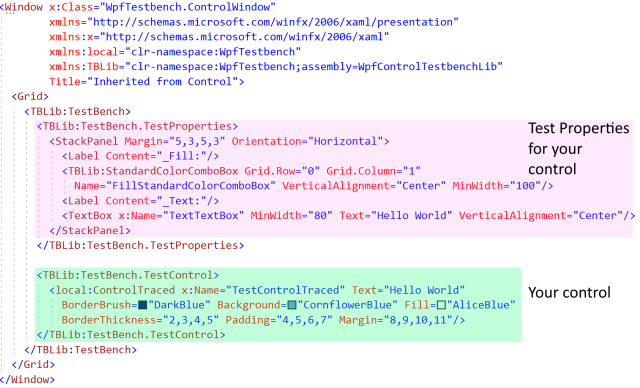

## Highlights
Reasons why any serious WPF developer should use `WpfControlTestbench`:
- Creating sophisticated test windows for your control with few lines of code
- Test you control visually and interactively
- Gain detailed insight into the interactions between the parent of your control and your control
- Minimize the time required for repeated testing from hours to minutes
- Examine Microsoft's controls and gain detailed knowledge which you cannot find anywhere else.

## Introduction
`WpfControlTestbench` helps you to write quickly sophisticated test windows for 
your control or any control whose behaviour you want to investigate. It takes 
only a dozen XAML lines to create the following `Window`: 



It displays your control to be tested in the lower left corner, in the upper 
part of the `Window` are `Controls` for all the properties of your control. You 
can change their values during run time. On the right lower corner you see a 
trace viewer showing any property whose value has changed and how the WPF 
container holding your control and your control do the layouting of your 
control.


 
WPF controls support an amazing range of layouting (`Margin`, `Border`, `Padding`, 
`Width`/`Height`, alignment, …) functionality and are accordingly challenging to 
develop. Even more difficult is to test if the control behaves properly 
under the many scenarios possible. The `WpfControlTestbench` lets you test 
this visually and interactively, you can see immediately what effect a 
property value change has on your control. Out of the box, 
`WpfControlTestbench` displays all important properties inherited from 
`FrameworkElement` and `Control`. Of course, you can easily add more controls to 
also investigate the properties specific to your control.

## Investigating the interaction of your Control and their WPF Parent
 

 
Controls behave differently depending on who is their `Parent` in the logic 
tree, i.e. into which WPF `ContentControl` or `Panel` they are placed. A 
`Canvas` might give all the space your control wants, while a `StackPanel` 
will limit how wide or tall your control can be. To get this interaction 
between different WPF `ContentControls` and your control work properly 
can be rather challenging. Luckily, `WpfControlTestbench` makes it very 
easy to place your control into different `ContentControls` at runtime.

## Debugging Measurement, Arrangement and Rendering problems
It is a kind of black magic to write a WPF `Control` which renders directly to 
the screen, but it offers great flexibility and the highest possible speed. 
Debugging it is difficult with Visual Studio because breakpoints cannot be 
used, they get constantly fired as soon VS tries to switch to your window, 
which then calls your methods, which stops at that breakpoint and shows VS 
again. You could use `System.Diagnostics.Debug.WriteLine()` to trace that 
information, however that can be a lot of work and you can't do that for the 
parent. But it's often the interplay with the parent which causes the 
problem. But fear not, `WpfControlTestbench` can trace all of this information 
for you and much more.



In the picture above, you can see CanvasContainer, which is the parent of 
the `Control` to be tested, called StackPanel. The parent gets 877 horizontal 
pixels and 381 vertical pixels screen space to arrange its children in it. 
The child StackPanel receives only 0 pixels, because during the measurement 
(not shown in the picture) it did not request any space, since it is empty. 
Interesting here is that the child is executing Render() already while it is 
still in the Arrange() call from its parent.
	
`WpfControlTestbench` makes the inner working of the controls transparent. It 
shows in a real time trace when which property was changed and how the 
parent and your control interact for the layouting of this change. 

When writing your own control, it is imperative that it behaves similarly 
like Microsoft's controls. But Microsoft's documentation lacks the needed 
information. To examine the behaviour of a Microsoft control, host it in 
`WpfControlTestbench`. Do the same for your own control and then verify that 
yours behaves the same in every scenario like Microsoft's.

## Control Sizing and Positioning
It is difficult to write a control whose content uses all available space, 
because the available space depends on numerous factors, like space given by 
host, margin, alignment and more. A simple formula for the screen width the 
child needs would look like this:

Required Width = LeftMargin + LeftBorder + LeftPadding + Content Width + RightPadding + RightBorder + RightMargin

Of course, required width is often different from the width that the host can provide. 

- What happens when there is too little space ? Too much space ?
- What happens if the `Width` property gets set (notice that it is not part of the formula above) ? 
- What happens if `Width` is undefined ? 
- What happens if `HorizontalAlignment` changes from `Left` to `Center`, `Right` or `Stretch` ?
- What happens when the `Font.Size` changes ?
- Does the parent or your control handle `Margin` ? `Padding` ?

**Answers:** 
- Too little space: If your control renders outside the given space, it depends on clipping if that is shown or not. Too much space: Depends on alignment. If not stretched, parent (!) will place the content accordingly. If streched, child should use all available space.
- When `Width` is set, your control is supposed to use exactly that space. If alignment is stretched, no stretching should happen, but the parent will center your control. 
- When `Width` is undefined, your control should figure out itself how much space it needs. 
- Changing `HorizontalAlignment` from `Left` to `Center` or `Right` does not matter for your control, the rendering is the same, but the parent will place it differently. Changing `HorizontalAlignment` from `Left` to `Stretch` will ask your control to render using all available size, not just the size it feels it should use.
- When the `Font.Size` (or `Font.Family` or …) changes, the content of your control might need more or less space, i.e. `Measure()`, `Arrange()` and `Render()` need to be executed.
- The host of your control handles `Margin`. Your control needs to handle `Border` and `Padding`.

Congratulations if you know the answers to all these questions. If not, 
sadly you will hardly find the answers in Microsoft's documentation. But as 
the developer of a control, you need to have a precise understanding how 
this works.

To get quickly answers to this kind of questions, use `WpfControlTestbench`, 
change some values and see how a Microsoft control reacts. Then implement 
the same behaviour for your control. Also helpful to better understand 
Microsoft controls is the `Show Template` button in the `TestBench` which shows 
the `ControlTemplate` XAML. If you really want to know details, you can also 
check the WPF source code at https://github.com/dotnet/wpf. But be warned, 
it can be complex.

Since getting the Sizing and Positioning right requires checking many 
scenarios and a pixel more or less might make a difference, 
`WpfControlTestbench` allows changing the width, alignments, etc. easily. 
It displays dashed lines for Margin, Border and Padding which can be moved 
with the mouse. Even the total available space can be easily changed with a 
mouse drag of the splitter line.
 


## Testing Standard Properties
You can also change properties by entering values with the keyboard, which 
can be more precise, but is also more time consuming.

If your control inherits from `FrameworkElement`, `WpfControlTestbench` displays 
properties for Width, Height, Alignment, Min, Max and Margin, which the user 
can change. DesiredWidth and RenderWidth are calculated values and cannot be 
changed. If your control inherits from `Control`, also properties for Border 
and Padding get displayed.
 


You can also change colors and fonts:



You can change the color of Background, Foreground (i.e. Font) and Border. 
Changing other font properties is interesting, since the required size of 
your control might depend also on FontFamily and Font.Size.

Clicking on Reset sets the values of all standard properties back to the 
values they had when the window opened.

## Standard Test
Since a `Control` has so many properties and all combinations of possible 
values should be tested, many tests need to be performed. If you set these 
values manually, you can easily spend hours and you might do that again and 
again over many days. But fear not, `WpfControlTestbench` has you covered also 
here. It comes with 111 predefined test settings for all interesting 
combinations of standard property values. And best of all, you can run 
through all these tests in a minute or two !

 

You just keep on clicking Next (Alt + N). Usually a quick glance tells you 
if everything looks ok. Of course, you can also easily add your own tests 
for the properties which are specific for your control, which is explained 
in detail further down.

## Try out WpfControlTestbench
Before you continue reading how you can write your own test windows, which 
is tedious reading, I recommend you download TestBench first from Github and 
give it a test run. I wrote it with VS 2022 and .NET 6. If you don't use VS 
2022 yet, just install that one too. You can run different VS versions on 
your PC, they do not interfere with each other.

When you start `WpfControlTestbench`, a small window appears:

 
 
In the left column are 2 tests for 2 controls provided by WPF, in the right 
column is a control I wrote. You can write your own application or add your 
test windows to this window. My hope is that other people will write test 
windows for other WPF controls and share those with us. Have a look for the 
TextBox test, which is rather sophisticated, but took me only 2 days to 
write.

## Preparing your Control for use in TestBench
Only read this and the next chapter if you are interested in the nifty 
gritty details of how to write your own test window.

When tracing the layouting process, one challenge is that it happens in the 
`Measure()` and `Arrange()` methods. Since these are not events, it is not 
possible for the `TestBench` to trace their execution. To make this possible, 
you have to inherit a new class from your control and override methods like 
`MeasureOverride()`. 

That new class needs to implement the simple `WpfControlTestbench` interface  
`ITraceName` or `IIsTracing` to support tracing:

```C#
    /// <summary>
    /// Provides a name for tracing
    /// </summary>
    public interface ITraceName {

      /// <summary>
      /// Name to be used for tracing
      /// </summary>
      string TraceName { get; }
    }


    /// <summary>
    /// Control can decide if it should get traced
    /// </summary>
    public interface IIsTracing: ITraceName {

      /// <summary>
      /// Controls if trace should get written
      /// </summary>
      public bool IsTracing { get; set; }
    }
```

There was a difficult problem to solve for tracing. The trace should show 
where the construction of your control starts, then which properties get set 
and finally a trace showing the control construction is completed. The 
challenge here is how do you write a trace before the constructor is executing ? 
Like in the example of `StackPanel`, there is no way to add a trace instruction 
at the beginning of its constructor.  It also does not help to write the start 
trace into a constructor of an inheriting class, since it only executes after 
the `StackPanel` constructor has finished. The solution was to use the following 
inheritance:

YourControl => YourControlWithConstructor => YourControlTraced

```C#
    public class YourControlWithConstructor: YourControl { 
      public YourControlWithConstructor(object? _) : base() { }
    }

    public class YourControlTraced: YourControlWithConstructor, ITraceName {

      public YourControlTraced() : this("YourControl") { }

      public YourControlTraced(string traceName) : base(TraceWPFEvents.TraceCreateStart(traceName)) {
        TraceName = traceName;
        TraceWPFEvents.TraceCreateEnd(traceName);
      }
    }
```

In XAML you place your test control like this:

```xml
    <local:YourControlTraced"/>
```

This XAML creates a C# line calling the parameterless constructor of YourControlTraced, which calls the other constructors like this:

    1) YourControlTraced()
      this("YourControl")
    
      2) YourControlTraced(string traceName) : 
         base(TraceWPFEvents.TraceCreateStart(traceName))
    	
         3) YourControlWithConstructor(object? _) : 
             base()

             4)YourControl ()

1)	Parameterless constructor of YourControlTraced calls the YourControlTraced 
    constructor with the parameter TraceName. Note that the WPF Name property cannot be used for tracing, because it gets its value assigned only after the constructor has completed.
2)	The YourControlTraced constructor with the TraceName traces the start of the constructor by calling the method ` TraceWPFEvents.TraceCreateStart(traceName)`, which returns null.
3)	The YourControlWithConstructor constructor has a parameter, but does not use it ! It finally calls the YourControl constructor.
4)	The YourControl constructor executes after a start trace is already written

Here is a complete code example to prepare StackPanel to be used in TestBench:

```C#
    using System.Windows;
    using System.Windows.Controls;
    using System.Windows.Media;

    namespace WpfTestbench {

      public class StackPanelWithConstructor: StackPanel {
        public StackPanelWithConstructor(object? _) : base() { }
      }

      public class StackPanelTraced: StackPanelWithConstructor, ITraceName {

        public string TraceName { get; private set; }

        public StackPanelTraced() : this("StackPanel", true) { }

        public StackPanelTraced(string traceName) : base(TraceWPFEvents.TraceCreateStart(traceName)) {
          TraceName = traceName;
          TraceWPFEvents.TraceCreateEnd(traceName);
        }

        protected override void OnPropertyChanged(DependencyPropertyChangedEventArgs e) {
          TraceWPFEvents.OnPropertyChanged(this, e, base.OnPropertyChanged, IsTracing);
        }

        protected override Size MeasureOverride(Size constraint) {
          return TraceWPFEvents.MeasureOverride(this, constraint, base.MeasureOverride, IsTracing); 
        }

        protected override Size ArrangeOverride(Size finalSize) {
          return TraceWPFEvents.ArrangeOverride(this, finalSize, base.ArrangeOverride, IsTracing);
        }

        protected override void OnRender(DrawingContext drawingContext) {
          TraceWPFEvents.OnRender(this, drawingContext, base.OnRender, IsTracing);
        }
      }
    }
```

Special here is that in the layouting overrides `TraceWPFEvents` methods are 
called, which

1)	Mark the start of the overridden method in the trace
2)	Call the overridden method
3)	Mark the end of the overridden method in the trace

If you wonder why not writing just one trace line, the reason is that for 
example the parent's `Measure()` calls the child's `Measure()`, which then looks 
like this:

    Trc 17:54:44.785 GridStarContainer.Measure(605, 517)
    Trc 17:54:44.786     StackPanel.Measure(585, 497)
    Trc 17:54:44.786     StackPanel.Measure(0, 0) end
    Trc 17:54:44.786 GridStarContainer.Measure(20, 20) end

It's exactly this kind of tracing information showing the interaction between 
the parent and child which helps solving layouting problems.

## Writing your own test window
Here is how the final test widow will look like:
 


It takes just few lines of XAML code (see *ControlWindow.xaml*):



You can add anything you like to your window. In this example, the window just 
contains a `TestBench`, which contains all the standard test properties and the 
tracer. You can add to `TestBench`:
+ `TestProperties`, where you can add something like a `StackPanel` or `Grid` containing `Labels`, `TextBoxes`, etc. to test the properties of your control
+ `TestControl`, where you place your control you want to test. This is also a good place to set property values of your control.

**Note:** If you change the `TestControl` in Xaml, you need to refresh the 
designer to see the new control.

In the code behind file you have to write only few lines of code:
 
```C#
    using System.Windows;
    using System.Windows.Data;
    using System.Windows.Media;

    namespace WpfTestbench {
      public partial class ControlWindow: Window {

        public ControlWindow() {
          InitializeComponent();

          WpfBinding.Setup(TextTextBox, "Text", TestControlTraced,
            ControlTraced.TextProperty, BindingMode.TwoWay);

          FillStandardColorComboBox.SetSelectedBrush(TestControlTraced.Fill??Brushes.Transparent);
          WpfBinding.Setup(FillStandardColorComboBox, "SelectedColorBrush", TestControlTraced,
            ControlTraced.FillProperty, BindingMode.TwoWay);
        }
      }
    }
```

All you have to do is to make your special properties work, which often can be 
done with just defining a binding in XAML or code behind. Easy, right ?

I wrote `WpfBinding()` to make my code look nicer when setting up a WPF binding:

```C#
    /// <summary>
    /// Helper class for setting up WPF bindings
    /// </summary>
    public static class WpfBinding {

      /// <summary>
      /// Allows the setup of a WPF binding with 1 line of code
      /// </summary>
      public static BindingExpression Setup(
        object sourceObject, string sourcePath,
        FrameworkElement targetFrameworkElement, DependencyProperty tragetDependencyProperty,
        BindingMode bindingMode,
        IValueConverter? converter = null,
        string? stringFormat = null) 
      {
        var newBinding = new Binding(sourcePath) {
          Source = sourceObject,
          Mode = bindingMode,
          Converter = converter,
          StringFormat = stringFormat
        };
        return (BindingExpression)targetFrameworkElement.SetBinding(tragetDependencyProperty, newBinding);
      }
    }
```

## Adding your own tests

You add lines like this to the constructor of your test window:

```C#
    TestBench.TestFunctions.Add(("Green Fill", fillGreen));
    TestBench.TestFunctions.Add(("Red Fill", ()=>{ TestControlTraced.Fill = Brushes.Red; return null;}));
    TestBench.TestFunctions.Add(("Width", testWidth));
    TestBench.TestFunctions.Add(("Reset Properties", resetProperties));
```

`TestFunctions` is a `List` in `TestBench`. Each entry is a test. At that point it is 
empty. `TestBench` will add at a later time its 100+ tests.

```C#
    public readonly List<(string Name, Func<Action?> Function)> TestFunctions;
```

A test consists of a name and a function which executes the test and might 
return another `Action`, which will verify if the test was successful or throw 
an exception. Since the layouting happens at a later time, it is not possible 
to verify if the test was successful in the test function. The verify action 
will get executed when the user presses the `NextButton` to execute the next 
text.

```C#
    private Action? testWidth() {
      oldWidth = TestControlTraced.Width;
      TestControlTraced.Width = 200;
      return verifyWidth;
    }


    private void verifyWidth() {
      if (double.IsNaN(TestControlTraced.Width)) return;

      if (TestControlTraced.ActualWidth==TestControlTraced.Width) {
        throw new InvalidOperationException($"Actual width should be {TestControlTraced.Width} " +
          $"but was {TestControlTraced.ActualWidth}.");
      }
    }
```

A failed test gets shown in the EventTracer like this:

    Trc 11:20:05.228 Test: Width
    Trc 11:20:05.228 Control.Width=200 
    …
    Trc 11:20:05.636 Control.ActualWidth=123

    Err 11:20:06.448 Test Error: Actual width should be 200 but was 123.
    System.InvalidOperationException
    ================================
    Actual width should be 200 but was 123.
    Data: System.Collections.ListDictionaryInternal
    Source: WpfControlTestbench
    HResult: -2146233079
       at WpfTestbench.ControlWindow.verifyWidth() in C:\Users\Peter\source\repos\WpfControlTestbench\WpfControlTestbench\ControlWindow.xaml.cs:line 98
       at WpfTestbench.TestBench.nextTestButton_Click(Object sender, RoutedEventArgs e) in C:\Users\Peter\source\repos\WpfControlTestbench\WpfControlTestbenchLib\TestBench.cs:line 895

It might be useful if the user can reset the property values which were changed 
by your test. To do that, add these lines to the constructor of your test 
window (for complete code, check *ControlWindow.xaml.cs*):

```C#
    resetFill = TestControlTraced.Fill;
    TestBench.ResetAction = () => TestControlTraced.Fill = resetFill;
```

`ResetAction` gets executed when the user presses the `ResetButton`.

## Recommended Reading
Congratulations again if you have read until here. For a better understanding 
how layouting works in WPF, I highly recommend to read my article on 
CodeProject (Best Article of February 2022, Second Prize):

[Deep Dive into WPF Layouting and Rendering](https://www.codeproject.com/Articles/5324971/Deep-Dive-into-WPF-Layouting-and-Rendering)


Some other top  rated WPF articles I wrote on StackOverflow:
- [Guide to WPF DataGrid Formatting Using Bindings](https://www.codeproject.com/Articles/683429/Guide-to-WPF-DataGrid-Formatting-Using-Bindings)
- [WPF DataGrid: Solving Sorting, ScrollIntoView, Refresh and Focus Problems](https://www.codeproject.com/Articles/5294035/WPF-DataGrid-Solving-Sorting-ScrollIntoView-Refres)
- [Definitive Guide to WPF Colors, Color Spaces, Color Pickers and Creating Your Own Colors for Mere Mortals](https://www.codeproject.com/Articles/5296124/Definitive-Guide-to-WPF-Colors-Color-Spaces-Color)
- [Base WPF Window Functionality for Data Entry](https://www.codeproject.com/Articles/5257393/Base-WPF-Window-Functionality-for-Data-Entry)

My Github projects which might be interesting for you:
- [WpfWindowsLib](https://github.com/PeterHuberSg/WpfWindowsLib): WPF Controls for data entry, detecting if required data is missing or data has been changed.
- [TracerLib](https://github.com/PeterHuberSg/TracerLib): Part of it used in `WpfControlTestbench`. Fast tracing of exceptions, errors and infos in memory, some entries can be written by a background thread to a file. Great to document what happened just before an exception occured.
- [StorageLib](https://github.com/PeterHuberSg/StorageLib): C# only library providing fast object oriented data storage in RAM and long term storage on local harddisk for single user applications. No database required.
- [MasterGrab](https://github.com/PeterHuberSg/MasterGrab): MasterGrab is a WPF game where a human player plays against several computer players (=Robots). You can program your own Robot in C#. Since 6 years I play it every day. It takes just about 10 minutes. Perfect for warming up my brain before starting to program.
